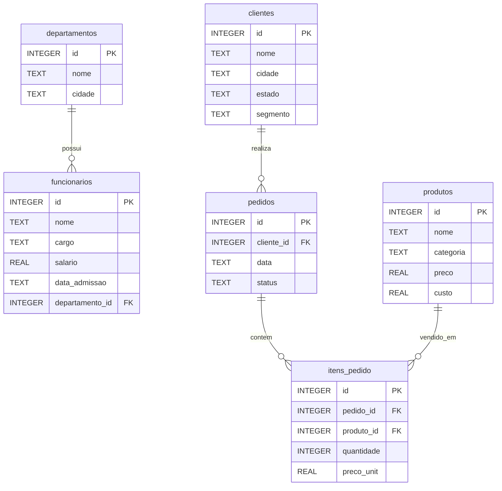

# Ambiente de Estudo SQL

Projeto de estudo com SQLite para praticar consultas SQL em um banco de dados
fictício de uma empresa de tecnologia. A base foi pensada para exercícios de
análise de dados, com funcionários, departamentos, clientes, produtos, pedidos e
itens de pedido.

## O que você vai praticar

- Nível 1: `SELECT`, `WHERE`, `ORDER BY`, `LIMIT`
- Nível 2: `GROUP BY`, `HAVING`, agregações e `JOIN`
- Nível 3: subqueries, CTEs e window functions
- Nível 4: análise de negócio, KPIs, margem, ticket médio e clientes
- Nível 5: projeto final com views, ranking, RFM e painel executivo

## Estrutura do projeto

```text
sql-estudo/
├── setup.py
├── README.md
├── dados/
│   └── empresa.db              # gerado localmente pelo setup.py
├── exercicios/
│   ├── nivel_1_basico.sql
│   ├── nivel_2_group_join.sql
│   ├── nivel_3_avancado.sql
│   ├── nivel_4_kpis_negocio.sql
│   └── nivel_5_projeto_final.sql
└── respostas/
    ├── gabarito_nivel_1.sql
    ├── gabarito_nivel_2.sql
    ├── gabarito_nivel_3.sql
    ├── gabarito_nivel_4.sql
    └── gabarito_nivel_5.sql
```

## Como usar

### 1. Pré-requisito

Instale o Python 3. O projeto usa apenas bibliotecas da própria instalação do
Python, então não é necessário instalar dependências externas.

### 2. Criar o banco SQLite

```bash
python setup.py
```

O comando cria o arquivo `dados/empresa.db` com os dados de exemplo.

### 3. Abrir no VS Code

Uma forma simples de executar os exercícios é usar a extensão **SQLite** de
`alexcvzz`.

1. Abra o VS Code na pasta do projeto.
2. Instale a extensão `SQLite`.
3. Use `SQLite: Open Database` e selecione `dados/empresa.db`.
4. Abra um arquivo em `exercicios/`, selecione a query e execute com
   `SQLite: Run Query`.

## Modelo de dados

O banco simula uma operação comercial simples: uma empresa tem departamentos e
funcionários, vende produtos para clientes e registra cada venda em pedidos com
itens.

```text
departamentos 1 ── N funcionarios
clientes      1 ── N pedidos
pedidos       1 ── N itens_pedido
produtos      1 ── N itens_pedido
```



## Tabelas disponíveis

| Tabela          | Registros | Descrição                                  |
|-----------------|-----------|--------------------------------------------|
| departamentos   | 6         | Áreas internas da empresa                  |
| funcionarios    | 15        | Pessoas, cargos, salários e admissão       |
| clientes        | 15        | Clientes B2B e B2C em vários estados       |
| produtos        | 16        | Hardware, software, acessórios e móveis    |
| pedidos         | 35        | Pedidos entre janeiro/2024 e janeiro/2025  |
| itens_pedido    | 56        | Produtos, quantidades e preços por pedido  |

## Como entender o banco

| Tabela | O que representa | Campos mais usados |
|--------|------------------|--------------------|
| `departamentos` | Áreas da empresa | `id`, `nome`, `cidade` |
| `funcionarios` | Pessoas que trabalham na empresa | `nome`, `cargo`, `salario`, `departamento_id` |
| `clientes` | Pessoas e empresas que compram | `nome`, `estado`, `segmento` |
| `pedidos` | Cabeçalho de cada compra | `cliente_id`, `data`, `status` |
| `itens_pedido` | Produtos dentro de cada pedido | `pedido_id`, `produto_id`, `quantidade`, `preco_unit` |
| `produtos` | Catálogo de produtos | `nome`, `categoria`, `preco`, `custo` |

Regras úteis para os exercícios:

- O valor vendido de um item é `quantidade * preco_unit`.
- O custo de um item é `quantidade * custo`.
- O lucro de um item é `quantidade * (preco_unit - custo)`.
- Para análises de venda real, use normalmente `pedidos.status = 'Entregue'`.
- `pedidos` guarda a compra; `itens_pedido` guarda os produtos dessa compra.

### Exemplo de pedido

O pedido `1` mostra como as tabelas se conectam:

| pedido | cliente | data | status | produto | quantidade | preço unitário | total do item |
|--------|---------|------|--------|---------|------------|----------------|---------------|
| 1 | Empresa Alpha Ltda | 2024-01-08 | Entregue | Mouse Sem Fio | 3 | 180.00 | 540.00 |
| 1 | Empresa Alpha Ltda | 2024-01-08 | Entregue | Notebook Pro 15 | 2 | 4500.00 | 9000.00 |

Query usada para chegar nesse resultado:

```sql
SELECT p.id AS pedido_id,
       c.nome AS cliente,
       p.data,
       p.status,
       pr.nome AS produto,
       ip.quantidade,
       ip.preco_unit,
       ROUND(ip.quantidade * ip.preco_unit, 2) AS total_item
FROM pedidos p
JOIN clientes c ON c.id = p.cliente_id
JOIN itens_pedido ip ON ip.pedido_id = p.id
JOIN produtos pr ON pr.id = ip.produto_id
WHERE p.id = 1
ORDER BY pr.nome;
```

Esse mesmo padrão de raciocínio aparece nos níveis 2, 4 e 5: partir de
`pedidos`, conectar cliente e itens, depois calcular receita, custo, lucro ou
ranking.

## Roteiro sugerido

1. Resolva `exercicios/nivel_1_basico.sql`.
2. Confira as respostas em `respostas/gabarito_nivel_1.sql`.
3. Repita o fluxo para os níveis 2, 3, 4 e 5.

Tente escrever as queries antes de olhar o gabarito. Os arquivos em
`respostas/` existem para conferência e comparação de abordagem.

Sequência recomendada:

| Nível | Arquivo | Foco |
|-------|---------|------|
| 1 | `nivel_1_basico.sql` | Consultas simples, filtros e ordenação |
| 2 | `nivel_2_group_join.sql` | Agregações e relacionamento entre tabelas |
| 3 | `nivel_3_avancado.sql` | Subqueries, CTEs e window functions |
| 4 | `nivel_4_kpis_negocio.sql` | Indicadores de negócio e análise comercial |
| 5 | `nivel_5_projeto_final.sql` | Relatório executivo usando views e rankings |

## Observações para publicar no GitHub

- O arquivo `dados/empresa.db` é gerado pelo `setup.py` e está ignorado no Git.
- Os arquivos `.sql` devem ser versionados, pois são o conteúdo principal do
  estudo.
- Se quiser permitir uso livre por outras pessoas, escolha uma licença antes de
  publicar o repositório.
