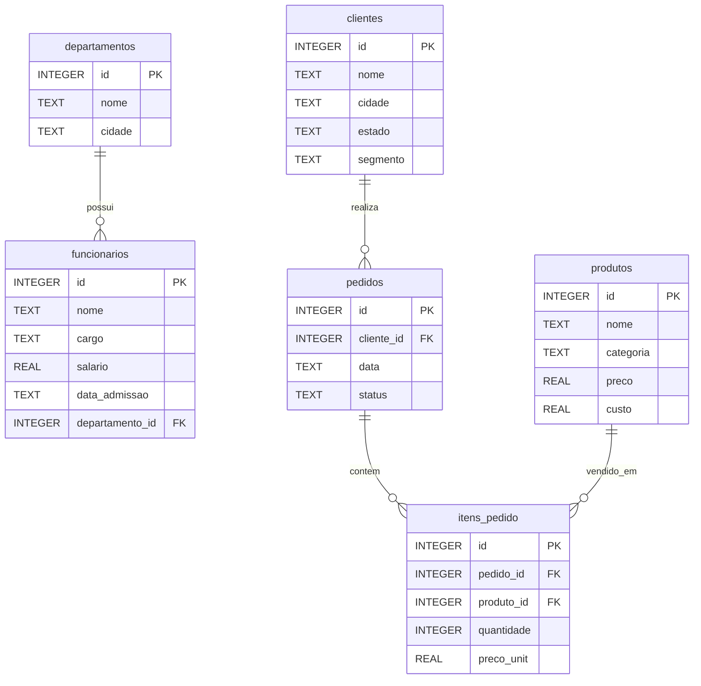

# Ambiente de Estudo SQL

Projeto de estudo com SQLite para praticar consultas SQL em uma base fictícia
de uma empresa de tecnologia. O ambiente tem duas formas de uso:

- **Web**: site estático com páginas separadas, trilha de estudo e laboratório
  SQL executando no navegador.
- **Local**: banco SQLite `dados/empresa.db`, gerado pelo `setup.py`, para uso
  no VS Code, SQLite Studio ou outra ferramenta.

## Páginas do site

| Página | Arquivo | Função |
|--------|---------|--------|
| Início | `index.html` | Visão geral do ambiente e atalhos |
| Trilha | `trilha.html` | Progresso por etapa, conectando Notion e repositório |
| Laboratório | `laboratorio.html` | Exercícios, anotações, timer e execução SQL segura |
| Base | `base.html` | Modelo de dados, tabelas e fontes da trilha |

## Como funciona a execução SQL no navegador

O laboratório web usa SQLite em WebAssembly via `sql.js`. A base é criada em
memória a partir de `empresa-seed.sql`.

Regras do laboratório:

- aceita apenas consultas de leitura começando com `SELECT` ou `WITH`;
- bloqueia comandos como `INSERT`, `UPDATE`, `DELETE`, `DROP`, `ALTER`,
  `CREATE`, `PRAGMA`, `ATTACH` e similares;
- exibe no máximo 100 linhas por execução;
- interrompe consultas longas recriando o worker;
- não usa backend, credenciais ou banco real;
- não publica `dados/empresa.db`.

O arquivo `empresa-seed.sql` contém somente a base fictícia necessária para o
treino web. O arquivo `dados/empresa.db` continua sendo um artefato local.

## O que você vai praticar

- Nível 1: `SELECT`, `WHERE`, `ORDER BY`, `LIMIT`
- Nível 2: `GROUP BY`, `HAVING`, agregações e `JOIN`
- Nível 3: subqueries, CTEs e window functions
- Nível 4: análise de negócio, KPIs, margem, ticket médio e clientes
- Nível 5: projeto final com views, ranking, RFM e painel executivo

## Estrutura do projeto

```text
sql-estudo/
├── index.html
├── trilha.html
├── laboratorio.html
├── base.html
├── styles.css
├── app.js
├── sql-worker.js
├── empresa-seed.sql          # base fictícia para o laboratório web
├── setup.py
├── README.md
├── dados/
│   └── empresa.db            # gerado localmente pelo setup.py
├── exercicios/
│   ├── nivel_1_basico.sql
│   ├── nivel_2_group_join.sql
│   ├── nivel_3_avancado.sql
│   ├── nivel_4_kpis_negocio.sql
│   └── nivel_5_projeto_final.sql
└── respostas/
    ├── gabarito_nivel_1.sql
    ├── gabarito_nivel_2.sql
    ├── gabarito_nivel_3.sql
    ├── gabarito_nivel_4.sql
    └── gabarito_nivel_5.sql
```

## Como usar pela web

1. Abra o site publicado na Vercel.
2. Entre em **Trilha** para acompanhar a sequência de estudo.
3. Entre em **Laboratório** para escolher nível e exercício.
4. Escreva a consulta no editor SQL.
5. Execute com o botão `Executar` ou com `Ctrl+Enter`.
6. Marque `Tentativa salva` antes de abrir o gabarito.

As anotações, tentativas salvas e progresso ficam no armazenamento local do
navegador.

## Como usar localmente

### 1. Pré-requisito

Instale o Python 3. O projeto usa apenas bibliotecas da própria instalação do
Python, então não é necessário instalar dependências externas para gerar o banco.

### 2. Criar o banco SQLite

```bash
python setup.py
```

O comando cria o arquivo `dados/empresa.db` com os dados de exemplo.

### 3. Abrir no VS Code

Uma forma simples de executar os exercícios é usar a extensão **SQLite** de
`alexcvzz`.

1. Abra o VS Code na pasta do projeto.
2. Instale a extensão `SQLite`.
3. Use `SQLite: Open Database` e selecione `dados/empresa.db`.
4. Abra um arquivo em `exercicios/`, selecione a query e execute com
   `SQLite: Run Query`.

## Modelo de dados

O banco simula uma operação comercial simples: uma empresa tem departamentos e
funcionários, vende produtos para clientes e registra cada venda em pedidos com
itens.

```text
departamentos 1 -- N funcionarios
clientes      1 -- N pedidos
pedidos       1 -- N itens_pedido
produtos      1 -- N itens_pedido
```


```mermaid
erDiagram
    departamentos ||--o{ funcionarios : possui
    clientes ||--o{ pedidos : realiza
    pedidos ||--o{ itens_pedido : contem
    produtos ||--o{ itens_pedido : vendido_em

    departamentos {
        INTEGER id PK
        TEXT nome
        TEXT cidade
    }

    funcionarios {
        INTEGER id PK
        TEXT nome
        TEXT cargo
        REAL salario
        TEXT data_admissao
        INTEGER departamento_id FK
    }

    clientes {
        INTEGER id PK
        TEXT nome
        TEXT cidade
        TEXT estado
        TEXT segmento
    }

    pedidos {
        INTEGER id PK
        INTEGER cliente_id FK
        TEXT data
        TEXT status
    }

    itens_pedido {
        INTEGER id PK
        INTEGER pedido_id FK
        INTEGER produto_id FK
        INTEGER quantidade
        REAL preco_unit
    }

    produtos {
        INTEGER id PK
        TEXT nome
        TEXT categoria
        REAL preco
        REAL custo
    }
```

## Tabelas disponíveis

| Tabela          | Registros | Descrição                                  |
|-----------------|-----------|--------------------------------------------|
| departamentos   | 6         | Áreas internas da empresa                  |
| funcionarios    | 15        | Pessoas, cargos, salários e admissão       |
| clientes        | 15        | Clientes B2B e B2C em vários estados       |
| produtos        | 16        | Hardware, software, acessórios e móveis    |
| pedidos         | 35        | Pedidos entre janeiro/2024 e janeiro/2025  |
| itens_pedido    | 56        | Produtos, quantidades e preços por pedido  |

## Regras úteis para os exercícios

- O valor vendido de um item é `quantidade * preco_unit`.
- O custo de um item é `quantidade * custo`.
- O lucro de um item é `quantidade * (preco_unit - custo)`.
- Para análises de venda real, use normalmente `pedidos.status = 'Entregue'`.
- `pedidos` guarda a compra; `itens_pedido` guarda os produtos dessa compra.

## Exemplo de pedido

O pedido `1` mostra como as tabelas se conectam:

```sql
SELECT p.id AS pedido_id,
       c.nome AS cliente,
       p.data,
       p.status,
       pr.nome AS produto,
       ip.quantidade,
       ip.preco_unit,
       ROUND(ip.quantidade * ip.preco_unit, 2) AS total_item
FROM pedidos p
JOIN clientes c ON c.id = p.cliente_id
JOIN itens_pedido ip ON ip.pedido_id = p.id
JOIN produtos pr ON pr.id = ip.produto_id
WHERE p.id = 1
ORDER BY pr.nome;
```

Esse mesmo padrão de raciocínio aparece nos níveis 2, 4 e 5: partir de
`pedidos`, conectar cliente e itens, depois calcular receita, custo, lucro ou
ranking.

## Roteiro sugerido

1. Abra a página **Trilha** e marque o ponto atual.
2. Vá para **Laboratório** e resolva `nivel_1_basico.sql`.
3. Execute a consulta no editor web ou localmente no VS Code.
4. Registre hipótese, granularidade, validação e dúvidas.
5. Marque `Tentativa salva`.
6. Confira o gabarito.
7. Repita o fluxo para os níveis 2, 3, 4 e 5.

Sequência recomendada:

| Nível | Arquivo | Foco |
|-------|---------|------|
| 1 | `nivel_1_basico.sql` | Consultas simples, filtros e ordenação |
| 2 | `nivel_2_group_join.sql` | Agregações e relacionamento entre tabelas |
| 3 | `nivel_3_avancado.sql` | Subqueries, CTEs e window functions |
| 4 | `nivel_4_kpis_negocio.sql` | Indicadores de negócio e análise comercial |
| 5 | `nivel_5_projeto_final.sql` | Relatório executivo usando views e rankings |

## Publicação

O repositório pode ser publicado como site estático no Vercel. O `.vercelignore`
exclui `dados/`, `.git/`, `.vercel/` e ambientes locais para evitar publicar o
banco SQLite local ou arquivos de configuração temporários.
